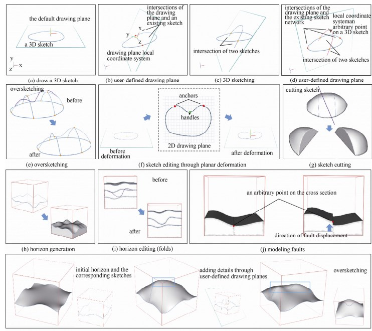

本文提出一种简单、快捷的草图交互式地质建模方法,旨在帮助地质学家们在地质勘测初期直观、快速地创建无数据地质概念模型.迄今,现存专业地质建模工具依赖成本较高的真实数据创建精细复杂的三维地质模型,且通常具有建模用时长、不易于学习和使用等缺陷.因此,采用直观的“纸-笔”建模隐喻,提供了一套从草图绘制到三维模型创建,再到三维模型编辑的完整建模流程,允许用户在自由定义的绘图平面上绘制描述模型地质特征的三维草图,并对其构成的连通草图网络实时地进行三维模型重建.模型重建使用分治的思想,大致分为3个步骤完成:首先利用三维草图的几何信息,即拐点,根据其拓扑连接搜寻草图网络中近似平面的能量最小圈,然后通过调和函数计算草图网络中每个圈包围区域的目标平均曲率标量及其法线方向,随后以 Laplacian 方程优化生成曲面片,最后将曲面片拼接成完整的三维模型.褶皱、断层地质现象可以分别通过重绘和切割操作进行建模.此外,利用层级结构树存储地质模型间的层级关系,并通过变形传递的方式对与形变物体接触的地质模型进行形变,从而保持了地质结构中多物质体相互接触的特性.相比现有基于草图的交互式建模工具,该方法融合了地质学知识,且能够更有效地使用少量草图描述地质物体的特征.基于用户体验调查,该方法具有操作简单、建模直观的特点,能够同时满足专业和非专业人士快速创建地质概念模型的需求. 

This paper proposes a sketch-based interactive geological modeling method, aiming at helping geologists to effectively create data-free conceptual geological models at the early stage of geological exploration. Up to date, the majority of the existing professional modeling tools take expensive measured data to build sophisticated 3D geological models, and usually suffer from the drawbacks of time-consuming and difficult to learn and use. Therefore, this paper exploits the intuitiveness of “paper-pencil” metaphor and develops a complete sketch-based interactive geological modeling framework, including 3D sketching, surfacing and sketch-based model editing. Geological sketches can be drawn on user-defined 3D drawing planes. Intersecting sketches constitute a sketch network, from which the corresponding 3D model is generated on the fly with the surface patching method. Specifically, surface patching employs the idea of divide-and-conquer and takes three steps. Based on the topology of the sketch network, planar cycles are first collected by minimizing their geometric energies, i.e. the corners. Then, surface patches are generated for each cycle by Laplacian optimization of the target mean curvatures and normals, which are pre-computed by harmonic functions. Finally, surface patches are stitched to make a complete 3D model. Geological phenomena such as folding and faulting can be modeled by over-sketching and cutting operations, respectively. In addition, the hierarchy of models is preserved in a hierarchical tree structure. To maintain the contact between geo-bodies, the deformation of an edited model is automatically transferred to its siblings and parents on the basis of their hierarchies. Compared to the existing sketch-based modeling tools, awareness of the geological knowledge makes the method advantageous in effectively describing geo
-bodies with fewer expressive sketches. Based on user experiences, this method is intuitive and easy-to-use for both professionals and inexperienced users to model illustrative geological scenarios.
