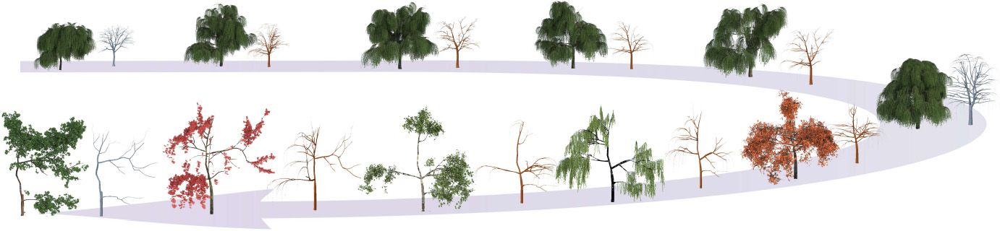

We present a new method to efficiently generate a set of morphologically diverse and inspiring virtual trees through hierarchical topology-preserving blending, aiming to facilitate designers’ creativity production. By maintaining the topological consistency of the tree branches, sequences of similar yet different trees and novel intermediate trees with encouragingly interesting structures are generated by performing inner-species and cross-species blending, respectively. Hierarchical fuzzy correspondences are automatically established between two or multiple trees based on the multi-scale topology tree representations. Fundamental blending tasks including morph, grow and wilt are introduced and organized into a tree-structured blending scheduler, which not only introduces the randomness into the blending procedure but also wisely schedules the tasks to generate topology-aware blending sequences, contributing to a variety of resulting trees that exhibit diversities in both geometry and topology. Most significantly, multiple batches of blending can be executed in parallel, resulting in a rapid creation of a large repository of diverse trees.

<video src='../images/tvcg2017.mp4'>
